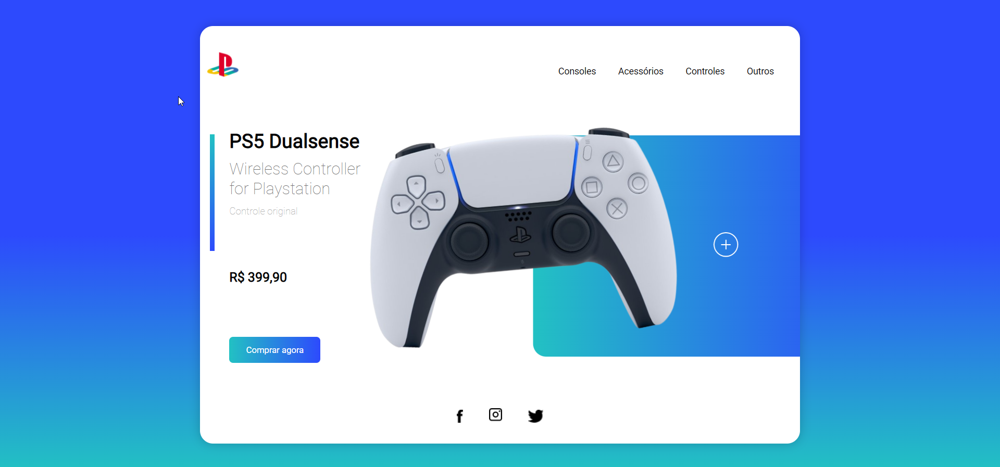

# Playstation Interface

> Projeto de interface responsivo.

### Ajustes e melhorias

O projeto ainda está em desenvolvimento e as próximas atualizações serão voltadas nas seguintes tarefas:

- [x] Fazer a tela de abertura 
- [x] Animar as imagens 
- [x] Deixar o projeto responsivo
- [ ] Fazer as demais telas para as categorias do menu 